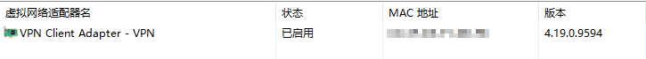

# MAC位址重覆

* VPN Client啟動時，會自動幫電腦裝一張虛擬的網卡，註冊的時候會讀取該卡的MAC。  
  重覆情況發生時，如果改掉MAC，就可以解決衝突

  

* 首先打開「執行」, 快速鍵是「Windows + R」

  * Windows 7: 開始 / 執行
  * Windows 10: 在左下角的開始上面按右鍵 / 執行

* 輸入 `devmgmt.msc`並按Enter

* 在「網路介面卡」中，找到名字和client下方顯示那張名字一樣的網卡，按「右鍵 / 內容」

* 在「進階 / MAC Address」中把MAC改掉\(如果沒有就生一組出來, MAC是12位數，每個位數都是16進制\)

  

* 改完後重新整理註冊頁面，或[重新登入](http://172.29.24.8/register)

* 註冊完後開始爽用，可以中斷VPN連線後重連，以加速註冊生效。

